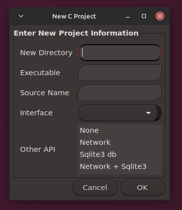
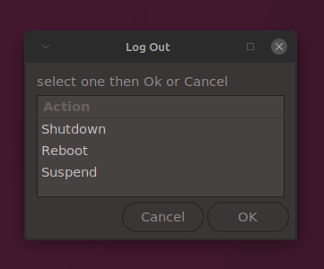

<a name="top"></a>
# my*.h Documentation
This document lays out quick help for these header files:
- myc.h - new string and other utility functions for C
- mydb.h - an Sqlite3 c template and three new functions
- mynet.h - a small Internet library with 4 new functions

NOTE: myc.h also _includes_ most of the common C headers. 
compiled myc.h totals about 43k

**[ String functions ](#mystringing)**
>
[between](#between 'int between(char *buf, char *input, char *str1, char *str2, int offset)') &bull;
[charat](#charat 'int charat(char *str, char c)') &bull;
[center](#center 'char * center(char *space, char *str, char *filler, int n)') &bull;
[chomp](#chomp 'char *chomp(char *str)') &bull;
[compare](#compare 'bool compare(char *s1, const char *op, char *s2) ') &bull;
[concat](#concat 'char *concat(char *dest, ..., END)') &bull;
[contains](#contains 'int contains(char *str, char *subs)') &bull;
[contvars](#contvars 'int contvars(char *str, char *delim)') &bull;
[string_cpy](#string_cpy 'bool string_cpy(string s, char *data)') &bull;
[string_new](#string_new 'string string_new(const char *str)') &bull;
[string_del](#string_del 'void string_del(string s)') &bull;
[string_def](#string_def 'string string_def(size_t length, char fill)') &bull;
[string_rsz](#string_rsz 'string string_rsz(string s, size_t length)') &bull;
[string_wrp](#string_wrp 'string string_wrp(char *in, size_t length, char sep)') &bull;
[deletechar](#deletechar 'char *deletechar(char* out, char* in, char target, size_t start, size_t number)') &bull;
[dollar](#dollar 'char *dollar(char *space, double amount, int fsize, int type)') &bull;
[endswith](#endswith 'bool endswith (char* str, char* subs)') &bull;
[equals](#equals 'bool equals(char *str1, char *str2)') &bull;
[equalsignore](#equalsignor 'bool equalsignore(char *str1, char *str2)') &bull;
[field](#field 'char *field(char *fld, char *str, char delimiter, int column, bool strip)') &bull;
[indexof](#indexof 'int indexof (char* base, char* str)') &bull;
[insert](#insert 'char *insert(char *buf, char *s, char *ins, size_t index)') &bull;
[insert_new](#insert_new 'char *insert_new(char *s, char *ins, size_t index)') &bull;
[isnum_us](#isnum_us 'bool isnum_us(char *var)') &bull;
[lastcharat](#lastcharat 'int lastcharat(char* base, char c)') &bull;
[lastindexof](#lastindexof 'int lastindexof (char* base, char* str)') &bull;
[lastsub](#lastsub 'char *lastsub (char *str, char *subs)') &bull;
[lof](#leftof 'char *lof(char *buf, char *in, char *delim, int start)') &bull;
[lowercase](#lowercase 'char *lowercase (char *str)') &bull;
[lpad](#lpad 'char *lpad(char *space, char *str, char *filler, int n)') &bull;
[ltrim](#ltrim 'char *ltrim (char *str)') &bull;
[replace](#replace 'char *replace (char *buf, char *in, char *target, char *replacement, int number)') &bull;
[replace_new](#replace_new 'char *replace_new (char *in, char *target, char *replacement, int number)') &bull;
[replacechar](#replacechar 'int replacechar(char *a, char b, char c, int number)') &bull;
[rof](#rightof 'char *rof(char *buf, char *in, char *delim, int start)') &bull;
[rpad](#rpad 'char *rpad(char *space, char *str, char *filler, int n)') &bull;
[rtrim](#rtrim 'char *rtrim (char *str)') &bull;
[startswith](#startswith 'bool startswith (char* str, char* subs)') &bull;
[strrev](#strrev 'char *strrev (char *str)') &bull;
[strtype](#strtype 'int strtype (char *s, int istype)') &bull;
[substr](#substr 'char *substr (char *buf, char *in, int position, int length)') &bull;
[trim](#trim 'char *trim (char *str)') &bull;
[uppercase](#uppercase 'char *uppercase (char *str)') &bull;
[urlencode](#urlencode 'char *urlencode (char *buf, char *str)')


**[ List - _static_ Array of strings ](#list_def)**
>
[list_del](#list_del 'void list_del(list a)') &bull;
[list_dir](#list_dir 'list list_dir(const char *path, int dtype, bool sort)') &bull;
[list_display](#list_display 'void list_display (list a)') &bull;
[list_def](#list_def 'list list_def (int nbr_rows, int len_rows)') &bull;
[list_find](#list_find 'int list_find(list lst, char *str)') &bull;
[list_init](#list_init 'void list_init(list lst, ...)') &bull;
[list_inject](#list_inject 'list_inject(list lst, char *value, int inx)') &bull;
[list_read](#list_read 'list list_read(char *filename, bool strip)') &bull;
[list_redef](#list_redef 'list list_redef(list lst1, int new_rows, int new_len)') &bull;
[list_remove](#list_remove 'void list_remove(list lst, int inx)') &bull;
[list_io](#list_io 'void list_io(list lst, char *fn, char mode)') &bull;
[list_split](#list_split 'int list_split (list *a, char *str, char *delim)') &bull;
[list_string](#list_string 'char *list_string(list lst, char *str, char *delim)') &bull;
[list_update](#list_update 'void list_update(list lst, char *str, size_t index)')

**[ Number to String functions ](#myntos)**
>
[intstr](#intstr 'char *intstr(char *buf, int n)') &bull;
[intstr_new](#intstr_new 'char *intstr_new(int n)') &bull;
[lngstr](#lngstr 'char *lngstr(char *buf, long n)') &bull;
[lngstr_new](#lngstr_new 'char *lngstr_new(long n)') &bull;
[dblstr](#dblstr 'char *dblstr(char *buf, double n, int decimal)') &bull;
[dblstr_new](#dblstr_new 'char *dblstr_new(double n, int decimal)')

**[ File & Path functions ](#mycfile)**
>
[file_exists](#file_exists 'bool file_exists (char *filename)') &bull;
[filesize](#filesize 'long filesize(const char *filename)') &bull;
[filecopy](#filecopy 'void filecopy(char *src, char *dst)') &bull;
[filedelete](#filedelete 'void filedelete(char *file)') &bull;
[filemove](#filemove 'void filemove(char *src, char *dst)') &bull;
[isfile](#isfile 'int isfile(const char* name)') &bull;
[getbasename](#getbasename 'char *getbasename(char *fn, bool withext)') &bull;
[getbasepath](#getbasepath 'char *getbasepath(char *fn, char *buff)') &bull;
[getfullpath](#getfullpath 'char *getfullpath(char *fn, char *buff)') &bull;
[open_for_append](#open_for_append 'FILE * open_for_append (char *fname)') &bull;
[open_for_read](#open_for_read 'FILE * open_for_read (char *fname)') &bull;
[open_for_write](#open_for_write 'FILE * open_for_write (char *fname)') &bull;
[readfile](#readfile 'int readfile (char *buffer, const char *filename)') &bull;
[textlines](#textlines 'void textlines(int count[2], char * fn)') &bull;
[writefile](#writefile 'int writefile (char *buffer, const char *filename, bool append)')

**[ Utility & Miscellaneous ](#mycother)**
>
[ARRSIZE](#ARRSIZE 'ARRSIZE(x)') &bull;
[date](#date 'char *date (char *format)') &bull;
[flogf](#flogf 'void flogf(FILE *f, char *format, ...)') &bull;
[timeout](#timeout 'void timeout (int sec, function)') &bull;
[multifree](#multifree 'void multifree(int num, ...)') &bull;
[ERRMSG](#ERRMSG 'ERRMSG(a, b, c) (errmsg(a, b, c, LINE))') &bull;
[isort](#isort 'void isort (int values[], int n)') &bull;
[dsort](#dsort 'void dsort (double values[], int n)') &bull;
[ssort](#ssort 'void ssort (const char* arr[], int n, bool case)') &bull;
[randini](#randini 'void randini()') &bull;
[randnum](#randnum 'long randnum(long min, long max)')


**[ Gtk Dialogs (zenity) ](#zenity)**
>
[zenmsg](#zenmsg 'int zenmsg(char *title, char *msg, char *type)') &bull;
[zenfile](#zenfile 'void zenfile(char *selected, char *start, bool savemode)') &bull;
[zenform](#zenform 'void zenform(char *formdata, char *layout)') &bull;
[zenlist](#zenlist 'void zenlist(char *selected, char *layout)') &bull;
[zentry](#zentry 'char *zentry(char *entry, char *title, char *text, char *starting)') &bull;
[zentext](#zentext 'void zentext(char* content, char *title, char *filename, bool edit)') &bull;
[zenotify](#zenotify 'void zenotify(char *text, bool icon)') &bull;
[zen](#zen 'void zen(char *buf, char *code)') 


**[ Sample program using myc.h ](#samplepgm)**


**[ Database Sqlite3 functions ](#mydb)**
>
[mydb_count](#mydb_count 'int mydb_count(char *tablename, char *where)') &bull;
[mydb_names](#mydb_names 'int mydb_names(char *tablename)') &bull;
[mydb_open](#mydb_open 'void mydb_open(char * dbname)')

**[ Net/Web functions ](#mynet)**
>
[webbrowser](#webbrowser 'bool webbrowser(const char *url)') &bull;
[webget](#webget 'bool webget(char *request)') &bull;
[webpage](#webpage 'bool webpage(char *mybuffer, int sz, char *url)') &bull;
[webpost](#webpost 'bool webpost(char *url, char *vp_data)')


---

# string.h

The standard C string.h library has fifteen or so functions for string
manipulation.

This section is a quick reference for the standard _string.h_ library.

## The Standard _string.h_ library for C

### memcpy(s,ct,n)
copy n chars from ct to s (may overlap) 

### memmove(s,ct,n)
copy n chars from ct to s (may overlap) 

### memcmp(cs,ct,n)
compare n chars of cs with ct

### memchr(cs,c,n)
pointer to first c in first n chars of cs

### memset(s,c,n)
put c into first n chars of s

### char \*strcpy( char \*s1, const char \*s2 )

copies the string s2 into the character array s1. The value of s1 is returned.

### char \*strncpy( char \*s1, const char \*s2, size_t n )

copies at most n characters of the string s2 into the character array s1. The value of s1 is
returned.

### char \*strcat( char \*s1, const char \*s2 )

appends the string s2 to the end of character array s1. The first character from s2
overwrites the '\0' of s1. The value of s1 is returned.

### char \*strncat( char \*s1, const char \*s2, size_t n )

appends at most n characters of the string s2 to the end of character array s1. The first
character from s2 overwrites the '\0' of s1. The value of s1 is returned.

### char \*strchr( const char \*s, int c )

returns a pointer to the first instance of c in s. Returns a NULL pointer if c is not
encountered in the string.

### char \*strrchr( const char \*s, int c )

returns a pointer to the last instance of c in s. Returns a NULL pointer if c is not
encountered in the string.

### char \*strdup(const char \*string)

returns a pointer to a duplicated string allocating
memory in the heap. Use free() to free memory.

### int strcmp( const char \*s1, const char \*s2 )

compares the string s1 to the string s2. The function returns 0 if they are the same, a
number < 0 if s1 < s2, a number > 0 if s1 > s2.

### int strncmp( const char \*s1, const char \*s2, size_t n )

compares up to n characters of the string s1 to the string s2. The function returns 0 if
they are the same, a number < 0 ifs1 < s2, a number > 0 if s1 > s2.

### size_t strspn( char \*s1, const char \*s2 )

returns the length of the longest substring of s1 that begins at the start of s1 and consists
only of the characters found in s2.
size_t strcspn( char \*s1, const char \*s2 )
returns the length of the longest substring of s1 that begins at the start of s1 and contains
none of the characters found in s2.

### size_t strlen( const char \*s )

determines the length of the string s. Returns the number of characters in the string
before the '\0'.

### char \*strpbrk( const char \*s1, const char \*s2 )

returns a pointer to the first instance in s1 of any character found in s2. Returns a NULL
pointer if no characters from s2 are encountered in s1.

### char \*strstr( const char \*s1, const char \*s2 )

returns a pointer to the first instance of string s2 in s1. Returns a NULL pointer if s2 is
not encountered in s1.

### char \*strtok(char \*s1, const char \*s2 )

repeated calls to this function modifies string s1 by breaking it into "tokens"--that is the
string is broken into substrings, each terminating with a '\0', where the '\0' replaces any
characters contained in string s2. The first call uses the string to be tokenized as s1;
subsequent calls use NULL as the first argument. A pointer to the beginning of the
current token is returned; NULL is returned if there are no more tokens.
consider using _list..._ in myc.h. 
_Warning: this changes the original string!_

---------------------------------------------------------------------------------------

<a name="mystringing"></a>
## STRING functions _myc.h_ [^](#top 'top')

**_I've tried not to duplicate the existing string.h functions. 
The goal here is to extend (and simplify) string manipulation in C._**

.

<a name="between"></a>
### int between(char \*buf, char \*input, char \*str1, char \*str2, int offset)
>Obtains a substring found between to other substrings. 
Returns an index to the next position beyond the second 
delimiting string. Returns -1 on not found or failure.

```c
  p = between(subs, page, "<p>", "</p>", 0);
  // returns the text between the paragraph tags.
```

<a name="charat"></a>
### int charat(char \*str, char c)
>Finds and returns the index of a character.
On failure returns -1. 

```c
 char * s = "Lorem ipsum dolor sit amet, consectetur adipiscing elit";
 
 printf("index of 'm' found at: %li\n", strchr(s, 'm') - s); // using string.h function
 
 // find index of 'm' with charat
 printf("index of 'm' found at: %i\n", charat(s, 'm')); // index of 'm' found at: 4

```
<a name="center"></a>
### char \* center(char \*space, char \*str, char \*filler, int n)
>Centers a string within a larger string.  
The initialized length of "space" must be greater than or equal to "n"  
which is the final length of "space" including "str".


<a name="chomp"></a>
### char \*chomp(char \*str)
>Returns the string with record separators 
removed from the end of the string.


<a name="compare"></a>
### bool compare(char \*s1, const char \*op, char \*s2)
>Returns _true_ or _false_ given two strings 
and a conditional operator:
>
| symbol| macro  | macro        |
| :---: | :-----: | :----------------- |
| ">"  | GT   | GreaterThan     |
| "<"  | LT   | LessThan      |
| ">=" | GTE   | GreaterThanOrEqual |
| "<=" | LTE   | LessThanOrEqual   |
| "==" | EQ   | Equal        |
| "!=" | NEQ   | NotEqual      |


```c
  if (compare("Dogs", ">=", "Cats"))
    puts("Dogs are at least equal to Cats");
  
  if (compare("Cats", LessThan, "Dogs"))
    ...
  if (compare(somestring, NEQ, someotherstring)) { ...
```
Note: only the "symbols == < > <= >= !=" may be used in variables


<a name="concat"></a>
### char \*concat(char \*dest, ..., END)
>Concatenate a variable number of strings.  
END must be used for the last argument.  
__Warning: the destination buffer must initialized large
enough to hold all the concatenations.__

```c
  char s[MAX_L];

  strcpy(s, "Ms ");

  concat(s, "Mary ", "Elizabeth ", "Smith", END);

  puts(s); // Ms Mary Elizabeth Smith
```

<a name="contains"></a>
### int contains(char \*str, char \*subs)
>Returns a count of the number of substrings found. 
Returns 0 if none found.

```c
 char line[] = "sed do eiusmod tempor incididunt ut labore";

  printf("%d\n", contains(line, "id"));  // 2
  printf("%d\n", contains(line, "e")); // 4
```

<a name="contvars"></a>
### int contvars(char \*str, char \*delim)
>Returns a count of the number of delimited 
variables or tokens found in a C string. 
Returns 0 if none found. Ignores delimiters
within double quotes.

<a name="string_def"></a>
### string string_def(size_t length, char fill)
>Returns a pointer to a new string allocated 
to size _length_ and initialized with 
all _fill_ character. Uses the _string_ struct.

```c
  typedef struct string {
    size_t length; // allocated length
    char *value;
  } string;
```

<a name="string_new"></a>
### string string_new(const char *str)
>Returns a pointer to a new string allocated 
to its size. Uses the _string_ struct.

```c
  string newstring = string_new("Hello World!");
  printf("%s - %ld\n", newstring.value, newstring.length);
  string_del(newstring);
```

<a name="string_rsz"></a>
### string string_rsz(string s, size_t length)
>Returns a new string variable re-allocated 
from an existing string.

```c
  string s = string_def(10, '\0');
  string_cpy(s, "Hello");
  puts(s.value);
  s = string_rsz(s, 20);
  strcat(s.value, " Universe");
  puts(s.value); // Hello Universe
  string_del(s);
```

<a name="string_cpy"></a>
### bool string_cpy(string s, char *data)
>Copies a string into a predefined  
heap string with boundary checking.  
Alternative to strncpy.

```c
    string s = string_def(32, '\0');
    string_cpy(s, "Hello World");
    puts(s.value);
    string_del(s);
```

<a name="string_del"></a>
### void string_del(string s)
>Frees memory for a string allocated 
with string_new or string_wrp.

<a name="string_wrp"></a>
### string string_wrp(char \*in, size_t length, char sep)
>Reformats lines of text into separate lines of size length. 
Lines are created on word boundaries. 
Returns a new string with memory allocated to hold 
the new block of text (string.)

```c
  char lines[] = "Lorem ipsum dolor sit amet,\nconsectetur adipiscing elit,\nsed do . . .";

  string wrapped = string_wrp(lines, 30, '\n');
  puts(wrapped.value);
  printf("allocated: %ld\n", wrapped.length);
  string_del(wrapped);
  
/*  OUTPUT:
 Lorem ipsum dolor sit amet,
 consectetur adipiscing elit,
 sed do eiusmod tempor
 incididunt ut labore et dolore
 magna aliqua. Ut enim ad minim
 veniam, quis nostrud
 exercitation ullamco laboris
 nisi ut aliquip ex ea commodo
 consequat.
 allocated: 255
*/
```

<a name="deletechar"></a>
### char \*deletechar(char \*buf, char \*in, char \*target, size_t start, size_t number)
>Removes all target characters from a string. 
Set starting index. 
Limit deletions or 0 means no limit. 

```c
  char rec[] = "\"Edgar\", Allan , Poe,, \"American Author\"";
  char data[100];

  printf("%s\n", deletechar(data, rec, "\"", 12, 2));
         // "Edgar", Allan , Poe,, American Author
  printf("%s\n", deletechar(data, rec, "\"", 0, 2));
         // Edgar, Allan , Poe,, "American Author"
  deletechar(data, data, "Aaeiou\"", 0, 0);
  puts(data);  // Edgr, lln , P,, mrcn thr
  deletechar(data, data, "Edgr, ", 0, 0);
  puts(data);  // llnPmcnth
```
<a name="dollar"></a>
### char \*dollar(char \*buff, double amount, int fsize, int type)
>Returns a formatted US currency dollar amount.  

* type: 1 = no $ and no separator  
* type: 2 = yes $ and no separator  
* type: 3 = yes $ and yes separator  

The formatted amount is returned right justified in the specified field size.  
**Warning: make sure the buffer is large enough to hold the formatted
dollar amount with any padding**


<a name="endswith"></a>
### bool endswith (char \*str, char \*subs)
>Returns true if string ends with specified substring,
otherwise returns false.

<a name="equals"></a>
### bool equals(char \*str1, char \*str2)
>Returns true if strings are equal,
otherwise returns false.

<a name="equalsignor"></a>
### bool equalsignore(char \*str1, char \*str2)
>Returns true if strings are equal
reguardless of any case differences,
otherwise returns false.

<a name="field"></a>
### char \*field(char \*fld, char \*str, char delimiter, int column, bool strip)
>Returns a substring at column n within a delimited string.
When _delimiter_ is a ' ' consecutive spaces act as a single
delimiter. When _strip_ is _true_ leading and trailing
whitespace is removed. Delimiters are ignored inside of
double quotes. Double quotes are NOT REMOVED in the result.
See _deletechar_ function to remove quote characters.
The original string is preserved. 
Returns NULL for an invalid column index.

```c
char rec[] = "Author, \"Edgar, Allan, Poe\",  American";
char data[100];

void main() {

  for (int x=0; x < 3; x++) {
   printf("field %d: [%s]\n", x, 
            field(data, rec, ',', x, true));
  }
  /* output:
   field 0: [Author]
   field 1: ["Edgar, Allan, Poe"]
   field 2: [American]

  */

  for (int x=0; x < 3; x++) {
   printf("field %d: [%s]\n", x, 
            field(data, rec, ' ', x, true));
  }
  /* output:
   field 0: [Author,]
   field 1: ["Edgar, Allan, Poe",]
   field 2: [American]
  */
}

```

<a name="indexof"></a>
### int indexof (char\* base, char\* str)
>Returns the index of a substring within a string. 
If not found returns -1.

<a name="insert"></a>
### char \*insert(char \*buf, char \*s, char \*ins, size_t index)
>Inserts a substring into a string at index.  
The new string is copied into the first argument and returned.  
**Warning: the buffer must be large enough to hold the original
string and the inserted string.**

```c
  char text[] = "Lorem ipsum dolor sit amet, consectetur adipiscing elit";
  char buf[120];

  insert(buf, text, " amor", 26);
  puts(buf); //Lorem ipsum dolor sit amet amor, consectetur adipiscing elit

  puts(insert(buf, text, "\n", 28));
    // Lorem ipsum dolor sit amet,
    // consectetur adipiscing elit

  puts(insert(buf, text, "prepended ", 0));
    // prepended Lorem ipsum dolor sit amet, consectetur adipiscing elit

  puts(insert(buf, text, " appended.", strlen(text))); //
    // Lorem ipsum dolor sit amet, consectetur adipiscing elit appended.
```

<a name="insert_new"></a>
### char \*insert_new(char \*s, char \*ins, size_t index)
>Inserts a substring into a string at index. 
Returns a pointer to the new string allocated in the heap. 
Note: use the standard c 'free' function to deallocate.

```c
  char text[] = "Lorem ipsum dolor sit amet, consectetur adipiscing elit";
  puts(text);
  char *buf = insert_new(text, " amor", 26);
  puts(buf);
  free(buf);

  /* OUTPUT
  Lorem ipsum dolor sit amet, consectetur adipiscing elit
  Lorem ipsum dolor sit amet amor, consectetur adipiscing elit
  */
```

<a name="lastcharat"></a>
### int lastcharat(char\* base, char c)
>Returns the __last index__ of some character
in a string. 
If not found returns -1.

<a name="isnum_us"></a>
### bool isnum_us(char\* str)
>Return _true_ if the string argument is 
numeric (whole or decimal) (US only).


<a name="lastindexof"></a>
### int lastindexof (char\* base, char\* str)
>Returns the __last index__ of a substring within
a string. 
If not found returns -1.

<a name="leftof"></a>
### char \*lof (char \*buf, char \*in, char \*delim, int start)
>Returns a pointer to a substring to the left of 
some delimiting string. 
A starting offet may be used or set to 0. 
Also see [rof](#rightof).

```c
char buf[MAX_L];
char *line = "Lorem ipsum dolor sit amet, consectetur adipiscing elit";

void main () {

  lof(buf, line, "amet, ", 0); // [Lorem ipsum dolor sit ]
  printf("[%s]\n", buf);

  printf("[%s]\n", rof(buf, line, "amet, ", 0)); 
                // [consectetur adipiscing elit]
}
```

<a name="lowercase"></a>
### char \*lowercase (char \*str)
>Returns the string in lower case.

<a name="ltrim"></a>
### char \*ltrim (char \*str)
>Returns the string with trailing whitespace
removed.

<a name="lpad"></a>
### char \*lpad(char \*buff, char \*str, char \*filler, int n)
>Returns a string with added left padding.
The padding (_filler_) is another string which is
repeated _n_ times. **Warning: the resulting buffer must be
large enough to hold the original string and the padding.**

<a name="replace"></a>
### char \*replace (char \*buf, char \*in, char \*target, char \*replacement, size_t start, size_t number)
>Replaces substrings within a string. 
Set starting index and limit replacements or set to 0, no limit.
**Warning: the resulting buffer must be
large enough to hold the original string and the replacements.**

```c
  char mystr[64] = "The long and winding road.";
  char newstr[128];

  puts(replace(newstr, mystr, " ", ", ", 8, 1));
  // The long, and winding road.

  replace(newstr, newstr, "and ", "", 0, 0);
  puts(newstr); // The long, winding road.
```

<a name="replace_new"></a>
### char \*replace_new (char \*in, char \*target, char \*replacement, size_t start, size_t number)
>Replaces substrings within a string. 
Limit replacements or set to 0, no limit. 
Returns a pointer to the new string allocated in the heap. 
Note: use the standard c 'free' function to deallocate.

```c
  char mystr[32] = "Lorem ipsum dolor sit amet";

  char * newstr = replace_new(mystr,
                "dolor",
                "labore et dolore magna",
                0, // start
                0); // how many
  printf("[%s] %ld\n", newstr, strlen(newstr));
  // [Lorem ipsum labore et dolore magna sit amet] 43

  free(newstr);
```

<a name="replacechar"></a>
### int replacechar (char \*in, char target, char replacement, int number)
>Replaces characters within a string. 
Limit replacements or set to 0, no limit. 
Returns count of replacements made.

```c
  int c = 0;
  char line[] = "abcd abcd abcd";

  c = replacechar(line, 'a', 'A', 0);
  puts(line); // Abcd Abcd Abcd

  c = replacechar(line+5, 'd', '7', 1);
  puts(line); // Abcd Abc7 Abcd
```

<a name="replacesz"></a>
### int replacesz(char \*in, char \*target, char \*replacement, int number)
>Returns a calculated new string length for a more accurate 
memory allocation size when creating an output buffer for replace.

<a name="rightof"></a>
### char \*rof (char \*buf, char \*in, char \*delim, int start)
>Returns a pointer to a substring to the right of
some delimiting string. 
Set a starting index or set to 0. 
See [lof](#leftof "lof function").

<a name="rpad"></a>
### char \*rpad(char \*buff, char \*str, char \*filler, int n)
>Returns a string with added right padding.
The padding (_filler_) is another string which is
repeated _n_ times.  **Warning: the resulting buffer must be
large enough to hold the original string and the padding.**

<a name="rtrim"></a>
### char \*rtrim (char \*str)
>Returns string with trailing whitespace
removed.

<a name="startswith"></a>
### bool startswith (char\* str, char\* subs)
>Returns true if a string starts with some substring,
otherwise returns false.

<a name="strrev"></a>
### char \*strrev (char \*str)
>Returns a string with the character
sequence reversed.

<a name="lastsub"></a>
### char \*lastsub (char \*str, char \*subs)
>Returns a pointer to the last occurrence 
of some substring within a string. 
Returns NULL if not found. 
_replaces missing strrstr function_

<a name="strtype"></a>
### int strtype (char \*s, int istype)
>functions to detect the type of a string.  
Compliments ctype.h functions for characters: 

```c
/*
ALPHA .. PUNCT is an enum in that order.
Returns int: 
- 0 = none found 
- N = number found 
- -1 = all found 
*/
  char string[] = "Amount: 123.21";

  printf("  ALPHA = %d\n", strtype(string, ALPHA));
  printf("  ALNUM = %d\n", strtype(string, ALNUM));
  printf("  DIGIT = %d\n", strtype(string, DIGIT));
  printf("  PUNCT = %d\n", strtype(string, PUNCT));
  printf("  PRINT = %d\n", strtype(string, PRINT));
  printf("  SPACE = %d\n", strtype(string, SPACE));
  printf("  UPPER = %d\n", strtype(string, UPPER));
  printf("  LOWER = %d\n", strtype(string, LOWER));

/* output:
  ALPHA = 6
  ALNUM = 11
  DIGIT = 5
  PUNCT = 2
  PRINT = -1
  SPACE = 1
  UPPER = 1
  LOWER = 5
*/
```

<a name="substr"></a>
### char \*substr (char \*buf, char \*in, int position, int length)
>Copies a substring within a string, located by a start 
position and a length, into a buffer, and returns it. 
Checks boundaries for overflow.

```c
  char s[64] = "Hello Sublime Text";
  char data[64];

  printf("\n%s\n", substr(data, s, 6, 0)); // Sublime Text

  printf("%s\n", substr(data, s, 6, 7));  // Sublime

  substr(data, s, 0, 13);
  printf("%s\n", data); // Hello Sublime
```

<a name="trim"></a>
### char \*trim (char \*str)
>Returns the string with both leading and
trailing whitespace removed.

<a name="uppercase"></a>
### char \*uppercase (char \*str)
>Returns the string in all upper case.

<a name="urlencode"></a>
### char \*urlencode (char \*buf, char \*str)
>Returns the string with all characters
conforming to Uniform Resource Locator
syntax rules.

```c
  char querystring[] = "?key=value;client=First Middle Last";
  char encoded[64] = {'\0'};

  urlencode(encoded, querystring);

  puts(encoded);
  // output: %3fkey%3dvalue%3bclient%3dFirst%20Middle%20Last
```

<a name="myntos"></a>
## Number to string functions _myc.h_ [^](#top 'top')
Static and Dynamic memory versions. 
Thousands separator optional for all.

<a name="intstr"></a>
### char \*intstr(char \*buf, int n, bool separator)
>Copies an integer into a string buffer and 
returns pointer to it.

<a name="intstr_new"></a>
### char \*intstr_new(int n, bool separator)
>Returns a new pointer to a string of an integer. 
(Dynamic)

<a name="lngstr"></a>
### char \*lngstr(char \*buf, long n, bool separator)
>Copies a long value into a string buffer 
and returns pointer to it.

<a name="lngstr_new"></a>
### char \*lngstr_new(long n, bool separator)
>Returns a new pointer to a string of a long value. 
(Dynamic)

<a name="dblstr"></a>
### char \*dblstr(char \*buf, double n, int decimal, bool separator)
>Copies a double value into a string buffer and 
returns a pointer to it. 
Requires a value for decimal places. 
Requires _true_ to include thousands separators.

<a name="dblstr_new"></a>
### char \*dblstr_new(double n, int decimal, bool separator)
>Returns a new pointer to a string of a double value. 
Requires a values for decimal places. 
Requires _true_ to include thousands separators. (Dynamic)

```c
  puts(dblstr(snum, 321321321.321 / 3, 2, true)); // automatic memory
  // 107,107,107.11

  double n_dbl = 123456789.101 / 3;
  char *rnum = dblstr_new(n_dbl, 4, false); // dynamic memory
  puts(rnum); // 41152263.0337
  free(rnum);
```

<a name="list_def"></a>
## Creating a List (_static_ array of strings) _myc.h_ [^](#top 'top')
>These functions operate around a _static_ array of strings, which 
means no inserts, deletes, or appends.

```c
 // struct used for list functions
 typedef struct list {
  int nbr_rows;  // maximum rows (columns, fields)
  int len_rows; // maximum length of one row (col, field)
  char ** item; // array of strings (fields)
 } list;
```

### list list_def (int _nbr\_rows_, int _len\_rows_)
>Returns a *list* structure variable with memory
allocated to hold an array of strings. 

```c
 list a = list_def(20, 65); // 20 items
```

<a name="list_init"></a>
### void list_init(list lst, ...)
>After creating a new list use this to 
initialize each element with a string literal. 
NOTE: Each list item must be initialized.

```c
  list my_list = list_def(5, 32);

  list_init( my_list,
        "first string",
        "second string",
        "third string",
        "fourth string",
        "fifth string" );
```

<a name="list_find"></a>
### int list_find(list lst, char \*str)
>Finds an item in the list and 
returns its index. Returns -1 
if not found.


<a name="list_update"></a>
### void list_update(list lst, char *str, int element)
>After creating a new list use this to initialize 
or change an element with a string literal. 

```c
  list my_list = list_def(5, 32);

  list_update(my_list, "F I R S T STRING", 0);
  list_update(my_list, "L A S T STRING", 4);
```

<a name="list_split"></a>
### int list\_split (list a, char \*str, char \*delim)
>Splits a delimited string into a list (an array of strings.) 
Returns _int_ of actual number parsed. 
Length of delimiter must be exactly 1. 
Define the list prior to using this function. 

```c
 list a = list_def(20, 65);
 int n = list_split(a, line_in, ",");
```
>Individual list items can now be accessed like:

```c
 a.item[n] // where n is the item (field) number
```

>Delimiters are ignored inside double quotes. 
Double quotes are NOT REMOVED from the result fields. 
See _deletechar_ function for removing quote characters. 
When delimiter is " " (space) consecutive spaces 
are treated as one delimiter. The input string is destroyed 
in the process.

<a name="list_del"></a>
### void list\_del(list a)
>Frees memory allocated by
list_def function.

```c
 list a = list_def(20, 32);
 // process ...
 list_del(a);
```

<a name="list_display"></a>
### void list\_display (list a)
>Prints out indexes and values
to the console.

<a name="list_inject"></a>
### void list_inject(list lst, char \*value, int inx)
>Inserts a new list item at an existing index. 
Values are shifted down to allow for the new value 
thus changing the indexs of the shifted items. 
The last item in the list is dropped off. 
The dimensions of the list are not changed. 
see [list_remove](#list_remove)


<a name="list_read"></a>
### list list_read(char *filename, bool strip) 
>Reads a text file's lines into a list and 
returns the new list. Ending line separator 
is removed. To remove all leading and 
trailing whitespace set _strip_ to _true_. 
Note: uses [textlines](#textlines) to calculate 
the new list's allocated size.

```c
  list flst = list_read("test.txt", false);
  list_display(flst);
  list_del(flst);
```

<a name="list_redef"></a>
### list list_redef(list lst1, int new_rows, int new_len)
>Returns a RE-DEFined list with new dimensions. 
Retains items from _lst1_ and deallocates _lst1_.

```c
void main (int argc, char *argv[]) {
  int x = 0;
  list lst = list_def(5, 32);

  list_init(lst, "Entry zero",
          "Entry ONE",
          "2 2 2 2 2",
          "Three Two One Zero",
          "ffoouurr");

  list_display(lst);

  puts("\nadding two more rows ...\n");

  lst = list_redef(lst, 7, 32);

  list_update(lst, "added 1 after redef", 5);
  list_update(lst, "added 2 after redef", 6);

  list_display(lst);

  list_del(lst);
}

/* OUTPUT
000 - [Entry zero]
001 - [Entry ONE]
002 - [2 2 2 2 2]
003 - [Three Two One Zero]
004 - [ffoouurr]

adding two more rows ...

000 - [Entry zero]
001 - [Entry ONE]
002 - [2 2 2 2 2]
003 - [Three Two One Zero]
004 - [ffoouurr]
005 - [added 1 after redef]
006 - [added 2 after redef]
*/
```

<a name="list_remove"></a>
### void list_remove(list lst, int inx)
>Removes a list item at an existing index. 
Values are shifted up to fill the space. 
thus changing the indexs of the shifted items. 
The last item in the list becomes empty (blank). 
The dimensions of the list are not changed. 
see [list_inject](#list_inject)


<a name="list_io"></a>
### void list_io(list lst, char *filename, char mode)
>Reads list items from and Saves to a text file. 
modes: 
* "r" read 
* "w" write


<a name="list_dir"></a>
### list list_dir(const char *path, int dtype, bool sort)
>Returns a list struct filled with file and/or directory
names for _path_. If _sort_ is "true" then the names
will be sorted in ascending order. 
_dtype_ must be set to: 
 dir = 0 files and directories 
 dir = 1 just files 
 dir = 2 just directories 
Note: list\_dir makes use of the list struct.

```c
  list d = list_dir("/home/user/", 1, true);
  list_display(d);
  list_del(d);

```

<a name="list_string"></a>
### char \*list_string(list lst, char \*str, char \*delim)
>Returns a field delimited string from _list_ items. 
Alphanumeric fields are enclosed in double quotes.


------------------------------------------------------------------------------------------------------

<a name="mycfile"></a>
## FILE & PATH functions _myc.h_ [^](#top 'top')

<a name="file_exists"></a>
### bool file\_exists (char \*filename)
>Return true if _filename_ exists
otherwise, returns false.

<a name="filesize"></a>
### long filesize(const char \*filename)
>Returns the byte size of a file.

<a name="filecopy"></a>
### void filecopy(char \*src, char \*dst)
>


<a name="filedelete"></a>
### void filedelete(char \*file)
>


<a name="filemove"></a>
### void filemove(char \*src, char \*dst)

```c
  if(file_exists(f2)) {
    if(zenmsg("Exists", "Overwrite Destination file?", "question") == ZENMSG_YES)
      filemove(f1, f2);
  } else {
    filemove(f1, f2);
  }
```


<a name="isfile"></a>
### int isfile(const char* name)
>Return 1 if _name_ is a file.
Returns 0 if _name_ is a directory.
Returns -1 if _name_ is undetermined.

<a name="getbasename"></a>
### char \*getbasename(char \*fn, bool withext)
>Returns the basename of a file with or without 
the file extension.

<a name="getbasepath"></a>
### char \*getbasepath(char \*fn, char \*buff)
>Returns only the fullpath of a file 
**without the file name** itself. 
_see getfullpath_

<a name="getfullpath"></a>
### char \*getfullpath(char \*fn, char \*buff)
>Returns the fullpath of a file. 
_see getbasepath_

<a name="open_for_append"></a>
### FILE \* open_for_append (char \*fname)
>Returns a FILE handle to _fname_ or
NULL if unsuccessful.

<a name="open_for_read"></a>
### FILE \* open_for_read (char \*fname)
>Returns a FILE handle to _fname_ or
NULL if unsuccessful.

<a name="open_for_write"></a>
### FILE \* open_for_write (char \*fname)
>Returns a FILE handle to _fname_ or
NULL if unsuccessful.

<a name="readfile"></a>
### int readfile (char \*buffer, const char \*filename)
>Loads _buffer_ with the contents of _filename_ or
returns -1 if unsuccessful.

<a name="textlines"></a>
### void textlines(int count[2], char \* filename)
>Returns count[0] number of lines and count[1] 
length of longest line in a text file.

<a name="writefile"></a>
### int writefile (char \*buffer, const char \*filename, bool append)
>Writes _buffer_ to the contents of _filename_ or
returns -1 if unsuccessful. 
Appends to file if _append_ is true.

--------------------------------------------------------------------------------------------------

<a name="mycother"></a>
## Utility & Miscellaneous (_myc.h_) [^](#top 'top')

<a name="ARRSIZE"></a>
### ARRSIZE(x)
>Macro expands to: _(sizeof(x) / sizeof((x)[0]))_ 
to return an array length (number of elements.)

<a name="isort"></a>
### void isort (int values[], int n)
>Sorts an array of n integer _values_.

<a name="ssort"></a>
### void ssort (const char\* arr[], int n, bool case)
>Sorts an array of n strings. if _case_ is "true" the
sort will be case-insensitive.

```c
char *strings[] = { "Zorro",
          "Alex",
          "Celine",
          "Bill",
          "Forest",
          "Dexter",
          "decimal man"};
. . .
 ssort(strings, ARRSIZE(strings), false);

 printout(ARRSIZE(strings));

 ssort(strings, ARRSIZE(strings), true);

 printout(ARRSIZE(strings));

/*
  OUTPUT:

  Alex
  Bill
  Celine
  Dexter
  Forest
  Zorro
  decimal man

  Alex
  Bill
  Celine
  decimal man
  Dexter
  Forest
  Zorro
*/
```

<a name="dsort"></a>
### void dsort (double values[], int n)
>Sorts an array of n doubles.

<a name="date"></a>
### char \*date (char \*format)
>Returns a date string in a strftime
format. 
(see _man strftime_ for the format
codes.)

```c
  puts(date("%B %F %r")); // February 2022-02-05 10:29:17 AM
```

<a name="flogf"></a>
### void flogf(FILE \* fs, char \*fmt, ...)
>A variation on fprintf to be used for logging and debugging. 
flogf only accepts the following formats:
>
| symbol | type |
| :---: | :--- |
|f |float / double |
|d |integer decimal |
|s | string |
|l |long |
|$ |double %.2f |


```c
  int x = 123;
  long y = 1231231234;
  double amount = 98765.345;

  flogf(stdout, "%s %d \n", "Value of x:", x);

  flogf(stdout, "long value:%l\n", y); // %l is long for flogf

  flogf(stderr, "log: %s line: %d -- amount: %$\n", __FILE__, __LINE__, amount);

  flogf(stdout, "%s Begin App!\n", date("%F %r"));

  FILE * log_file = open_for_append("logfile.txt");
  flogf(log_file, "%s Begin App!\n", date("%F %r"));
  fclose(log_file);

   /////////// OUTPUT ////////////
  // Value of x: 123
  // long value:1231231234
  // log: flogf.c line: 62 -- amount: 98765.35
  // 2022-03-29 02:12:24 PM Begin App!
  //
```

<a name="timeout"></a>
### void timeout (int sec, function)
>_timeout_ sets up a SIGALRM to call _function_
after _sec_ seconds.

```c
  void timeout_hand() {
    // user timout handler function
   // code actions to occur
   // at end of timeout
  }

  . . .

  timeout(6, timeout_hand); // call "timout_hand" every 6 seconds

  . . .

```

<a name="multifree"></a>
### void multifree(int num, ...)
>Free multiple (_num_) heap pointers. 
Also sets to NULL.

```c
 char *w1 = malloc(1000);
 char *w2 = malloc(2000);

 multifree(2, w1, w2);

```
<a name="ERRMSG"></a>
### ERRMSG(a, b, c) (errmsg(a, b, c, __LINE__))
>Macro to display an error event 
errmsg works with the ERRMSG macro 
use ERRMSG with three arguments: 
1> the return code to be checked 
2> _true_ or _false_ to terminate the program 
3> an additional error or debug message (string) 

```c

 if (realpath("../nope", fpath) == NULL) {
  ERRMSG(errno, true, "realpath returned NULL");
 } else {
  puts(fpath);
 }

/* OUTPUT
 ERRMSG near line: 40, errno: 2 No such file or directory
 realpath returned NULL
 Program Exited
*/

```
Use -1 in 1st argument for non-stock error message.


<a name="randini"></a>
## void randini()
>Seeds random number generator.
Use once before using one or more calls to randnum function.


<a name="randnum"></a>
## long randnum(long min, long max)
>Returns a randum number between and inclusive
of some min and max values.

----------

<a name="zenity"></a>
## Gtk Dialogs [^](#top 'top')
>[ website ](https://help.gnome.org/users/zenity/3.32/ 'gnome.org') 
Zenity is required for these functions.

```c
 apt install zenity
```

<a name="zenmsg"></a>
### int zenmsg(char \*title, char \*msg, char \*type)
>Message dialog of four varieties: _info, question, error, warning_.

```c
  if (zenmsg("Hey!", "Asking you a question ...", "question")) {
    zenmsg("title", "you answered NO", "info"); // returned 256
  } else {
    zenmsg("TITLE ..", "you answered YES", "info"); // returned 0
  }
```

<a name="zenfile"></a>
### void zenfile(char *selected, char *start, bool savemode)
>File dialogs for _open_ or _save_. 
_savemode_ open = __false__, save = __true__ 
Existence of file to be saved is not checked. 
Selected file fullpath stored into first argument.

```c
  char data[256];
  zenfile(data, "/usr/local/bin", false); // open file dialog
  puts(data);

```

<a name="zenform"></a>
### void zenform(char *formdata, char *layout)
>Design and show a form to collect information. 
Form widgets include: entry, calendar, list, and combo 
A delimited string of responses is stored into first argument.

```c
  char data[256];
  char form_layout[] =
    "--title='New Member' "
    "--text='Enter your information' "
    "--separator=',' "
    "--add-entry='Your full name' "
    "--add-password='Password' "
    "--add-entry='Your Email' "
    "--add-combo='Fav ice cream' "
    "--combo-values='strawberry|cherry|vanilla|chocolate' "
    "--add-calendar='Birthday' "
    "--add-list='Fav Color' "
    "--list-values='black|blue|red|orange|green|yellow' ";
  zenform(data, form_layout);
  puts(data); // Delimited items from the form response
```

<a name="zenlist"></a>
### void zenlist(char *selected, char *layout)
>Design and show a list with columns. 
column data is space delimited. 

```c
  char list_layout[] =
    "--title='New Friends' "
    "--text='Enter your information' "
    "--print-column='1' " // or 'ALL'
    "--multiple "    // optional multiple row selection
    "--separator=',' " // optional delimited results 
    "--column='Name' "   // column 1
    "--column='Age' "    // column 2
    "--column='Fav Color' " // column 3
    "Jack 70 orange " // space delimited data ...
    "Joel 60 blue "
    "Jill 65 yellow "
    "Jane 66 purple "
    "James 50 'dark red' ";

  zenlist(data, list_layout);
  puts(data); // what was selected
```

<a name="zentry"></a>
### char *zentry(char *entry, char *title, char *text, char *default)
>Dialog with a single entry field. 

```c
  char data[256];
  zentry(data, "zentry exam.", "Enter something witty!", "");
  puts(data); // what was entered
```

<a name="zentext"></a>
### void zentext(char* content, char *title, char *filename, bool edit)
>Dialog to display/edit simple text file. 
_false_ = read only. 

```c
  zentext(data, "Notes (edit)", "testinfo.txt", true);
  // edited content is now in 'data'
  // write back the the file
  FILE * f = open_for_write("testinfo.txt");
  fprintf(f, "%s", data);
  fclose(f);
```

<a name="zenpass"></a>
### char *zenpass(char *pass, char* title, bool username)
>Dialog to obtain username and password 
or just password (_false_)

```c
  zenpass(data, "user / passwd", true);
```

<a name="zenotify"></a>
### void zenotify(char *text, bool icon)
>Displays a system notification. 
_true_ to include an "info" icon. 

"Time Break" program:

```c
char mesg[256] = {'\0'}; // your message from argv[1]
int sec = 0; // wait time set from argv[2]

void main (int argc, char *argv[]) {

  if (argc < 3)
    ERRMSG(-1, true, "Missing Arguments: message seconds");

  sec = atoi(argv[2]);
  strcpy(mesg, argv[1]);

  while(true) {
    if (file_exists("timebrk.stop")) {
      filedelete("timebrk.stop");
      zenotify("Stopping timebrk", true);
      exit(EXIT_SUCCESS);
    } else {
      zenotify("Starting TimeBrk", true);
    }
    sleep(sec);
    zenmsg("Time Brk", argv[1], "warning");
  } // while infinite loop
}
```

<a name="zen"></a>
### void zen(char *buf, char *code)
>This is a generic function for zenity dialogs. 
Put all of the zenity code except "zenity" in 
the second argument.

```c

  /*
    The "zen" function is completely 'free form'.
    It just supplies the 'zenity ' command and you
    supply the rest in a string. It purpose is to
    allow for other zenity dialogs or variations
    not covered by the other "myc.h zenity" functions.
    https://help.gnome.org/users/zenity/stable/index.html.en#dialogs
  */

  // color picker dialog
  zen(data, "--color-selection --show-palette");
  puts(data);

  // scale dialog
  zen(data, "--scale --text='How many jelly-beans are in the jar?' --value=100");
  puts(data);

  // password entry dialog
  zen(data, "--password --username");
  puts(data);

  // calendar dialog
  concat(src, "--calendar ",
        "--text='Click on a date to select it.' ",
        "--date-format='%F' ", // strftime formats
        "end");
  zen(data, src);
  puts(data);

```

----
----

<a name="samplepgm"></a>
## Sample Program using myc.h [^](#top 'top')

>Here is a simple program that sets up a C project. 
It uses some of the zenity functions as well as 
several myc functions. Notice in particular 
how the list\_ functions and enums help with the output 
from the zenform to make the process clean and easy.

```c
/* cproj.c
 This is a simple demo of what a C program
 looks like when using some of the myc.h
 features. It uses some of the zenity functions 
 as well as several myc functions. Notice in particular 
 how the list\_ functions and enums help with the output 
 from the zenform to make the process clean and easy.
*/
```


```c
#include <myc.h>

void main (int argc, char *argv[]) {

  char specs[1024] = {'\0'}; // will be used for multiple purposes
  char path[1024] = {'\0'};
  char initial[256] = {'\0'};
  enum names {DIR, EXC, SRC, MODE, API}; // five fields

  char form_layout[] =
    "--title='New C Project' "
    "--text='Enter New Project Information' "
    "--separator=',' "
    "--add-entry='New Directory' "
    "--add-entry='Executable' "
    "--add-entry='Source Name' "
    "--add-combo='Interface' "
    "--combo-values='Gtk-3|Console' "
    "--add-list='Other API' "
    "--list-values='None|Network|Sqlite3 db|Network + Sqlite3' ";
  zenform(specs, form_layout);

  list form = list_def(5, 64);
  list_split(form, specs, ",");

  if (equals(form.item[EXC], "") ||
    equals(form.item[SRC], "") ||
    equals(form.item[MODE], "") ||
    equals(form.item[API], "")) {
    zenmsg("Aborting", "Canceled or One or more fields left blank.", "error");
    exit(EXIT_FAILURE);
  }

  // Obtain default path to projects
  readfile(initial, "initial_directory"); // one line file with main proj path
  zenfile(path, trim(initial), false, true);

  // HAVE ALL INPUTS

  // Make directory and copy over starter source file
  strcpy(specs, path);
  concat(specs, "/", form.item[DIR], END);
  mkdir(specs, 0755);
  concat(specs, "/", form.item[SRC], END);
  filecopy("./src.c", specs);

  /*
    Create complile script (cmpc)
    The helper scripts (cmp_con, cmp_gtk)
    should be placed in the system path.
    This generated script (cmpc) will provide
    the correct parameters to one of these two
    scripts.
  */

  if ( equals(form.item[MODE], "Console") ) {
    strcpy(specs, "cmp_con ");
  } else {
    strcpy(specs, "cmp_gtk ");
  }

  concat(specs, 4, form.item[EXC], " ", form.item[SRC], " ");

  if ( equals(form.item[API], "Network"))
    strcat(specs, "\"-l curl\"");
  else if ( equals(form.item[API], "Sqlite3"))
    strcat(specs, "\"-l sqlite3\"");
  else if ( equals(form.item[API], "Network + Sqlite3"))
    strcat(specs, "\"-l sqlite3 -l curl\"");

  strcat(specs, " \n"); // add a linefeed

  // WRITE "cmpc" FILE

  concat(path, "/", form.item[DIR], "/cmpc", END);

  writefile(specs, path, false);

  // SET EXECUTE PERM ON cmpc

  sprintf(specs, "chmod 755 %s", path);
  system(specs);
  zenotify("cproj completed", true);
}
```

## Sample Program
### Log Out Gui


```c
#include <myc.h>

void main () {
    char data[256] = {'\0'};

    char list_layout[] =
    "--title='Log Out' "
    "--text='select one then Ok or Cancel' "
    "--separator=' ' "
    "--column='Action' "
    "Shutdown "
    "Reboot "
    "Suspend ";

    zenlist(data, list_layout);
    puts(data); // what was selected

    if(equals(data, "Shutdown")) {
        system("shutdown now");
    }
    else if(equals(data, "Reboot")) {
        system("reboot");
    }
    else if(equals(data, "Suspend")) {
        system("systemctl suspend");
    }
    else {
        exit(EXIT_SUCCESS);
    }
}
```
---
----------

<a name="mydb"></a>
## DATABASE Sqlite3 _mydb.h_ [^](#top 'top')

<a name="mydb_open"></a>
### void mydb\_open(char \* dbname)
>Opens an Sqlite3 database using file
name is *dbname*. 
Checks for existing database file. 
Exits with error if open fails. 
_db_ is the database connection pointer. 
To open another database the open one must
be closed first with sqlite3_close(db);

<a name="mydb_count"></a>
### int mydb\_count(char \*tablename, char \*where)
>Returns a count(\*) result. Uses a *where* clause. 
Use empty quotes in where clause to count all rows.

```c
 mydb_open("guns.db");
 printf("total rows = %i\n\n", mydb_count("guns", ""));
 printf("total rows = %i\n\n", mydb_count("guns", "where sex = 'Female'"));
```

<a name="mydb_names"></a>
### int mydb\_names(char \*tablename)
Loads an array of strings (*mydb_col*)
containing the text of the column names. 
Returns the count of columns.
```c
  mydb_open("guns.db");
  rc = mydb_names("guns"); // table name is 'guns'

  printf("number of columns = [%d]\n", rc);

  for (int x=0; x < rc; x++) {
    printf("%s\n", mydb_col[x]);
  }
```
#### Template

The following function template must be used to process the row/col
values after using the sqlite3_exec function. Have one or many.
```c
/*
user function to handle result set
note:  may need many different callback functions and/or
     use the qid parameter to direct action in one callback
*/
static int resultset(void *qid, int argc, char **argv, char **col) {
  int i;

  // (const char*)qid; // can use for process control or heading

  // one row: process each column in order of sql statement
  for(i = 0; i<argc; i++) {
    printf("%s = %s\n", col[i], argv[i] ? argv[i] : "NULL");
  }
  return 0;
}
```


#### Example

```c
/***
Example using mydb.h functions and above template ...
***/
  int rc = 0;

  mydb_open("guns.db"); // the database pointer is now 'db'

  //char * sql = "select distinct education from guns";

  rc = sqlite3_exec(db,
             "select distinct education from guns",
             resultset,
             "ITEM>>>>", // or whatever
             0); // or &err_msg

  printf("rc from exec was [%d]\n\n", rc); // 1==ERROR, 0==SUCCESS

  printf("total rows = %i\n\n", mydb_count("guns", "")); // -1==FAIL

  rc = mydb_names("guns"); // -1==FAIL | loads **mydb_col

  printf("number of columns = [%d]\n", rc);

  for (int x=0; x < rc; x++) {
    printf("%s\n", mydb_col[x]);
  }

  sqlite3_close(db);

```

-----------------------------------------------------------------------------------------

<a name="mynet"></a>
## NET/WEB functions _mynet.h_ [^](#top 'top')

<a name="webpage"></a>
### bool webpage(char \*mybuffer, int sz, char \*url)
>Returns the web page code text from _url_
into _mybuffer_. 
_sz_ is buffer size of _mybuffer_.

```c
 char *pagebuf;
 pagebuf = calloc(10000, sizeof(char*));
 if (!webpage(pagebuf, 10000, "https://example.com")) {
  printf("exiting because of webpage failure\n");
  exit(1);
 } else {
  printf("webpage success!\n%s\n", pagebuf);
 }
 
```

<a name="webget"></a>
### bool webget(char \*request)
>Perform a GET request with _key-value_ querystring.

```c
  concat(dat, "https://somewhere.net/test/fromgetcurl.php",
          "?data=",
          urlencode(wrk, "1st-key is data"),
          "&var=",
          urlencode(wr2, "2nd-key is 'var'..."),
          "End");

  if (!webget(dat)) {
   printf("exiting because of webget failure\n");
   exit(EXIT_FAILURE);
  } else {
   printf("webget success!\n");
  }

```

<a name="webpost"></a>
### bool webpost(char \*url, char \*vp_data)
>Perform a POST request to _url_ with
payload *vp_data*.

```c
 char url[] = "https://somewhere.net/test/frompostcurl.php";
 
 // prepare querystring
 concat(dat, "data=",
        urlencode(wr1, "content & ampersand!"),
        "&var=",
        urlencode(wr2, "second variable content!!!!"),
        END);

 // post to server
 if (!webpost(url, dat)) {
  printf("exiting because of webpost failure\n");
  exit(1);
 } else {
  printf("webpost success!\n");
 }

```

<a name="webbrowser"></a>
### bool webbrowser(const char \*url)
>Opens the website at _url_ in the
current system default browser.

```c
  if (!webbrowser("https://tekvow.net")) {
   printf("exiting because of webbrowser mynet.h failure\n");
   exit(1);
  } else {
   printf("webbrowser success!\n");
  }

```


---

_end of document_
